# Дорожная карта курса Golang Backend Developer

## Ordered List

1. Linux (Basic)
2. Git (Basic)
3. Golang (Basic)
4. Unit Testing
5. DSA (Basic)
6. Internet Networking (Basic)
7. Golang (Advanced)
8. Restful API (Basic)
9. Docker (Basic)
10. Postgres (Basic)
11. Integration Testing
12. CI/CD (Basic)
13. Kafka (Basic)
14. gRPC (Basic)
15. Caching (Basic)
16. Redis/Valkey (Basic)
17. RabbitMQ (Basic)
18. Restful API (Advanced)
19. Postgres (Advanced)
20. gRPC (Advanced)
21. Docker (Advanced)
22. Kubernetes (Basic)
23. Microservices (Basic)
24. Kafka (Advanced)
25. RabbitMQ (Advanced)
26. Microservices (Advanced)
27. ElasticSearch (Basic)
28. Observability (Basic)
29. DSA (Advanced)

## Mermaid

```mermaid
flowchart TD
 N1["Linux (Basic)"] --> N2["Git (Basic)"];
 N2 --> N3["Golang (Basic)"];
 N3 --> N4["Unit Testing"];
 N4 --> N5["DSA (Basic)"];
 N5 --> N6["Internet Networking (Basic)"];
 N6 --> N7["Golang (Advanced)"];
 N7 --> N8["Restful API (Basic)"];
 N8 --> N9["Docker (Basic)"];
 N9 --> N10["Postgres (Basic)"];
 N10 --> N11["Integration Testing"];
 N11 --> N12["CI/CD (Basic)"];
 N12 --> N13["Kafka (Basic)"];
 N13 --> N14["gRPC (Basic)"];
 N14 --> N15["Caching (Basic)"];
 N15 --> N16["Redis/Valkey (Basic)"];
 N16 --> N17["RabbitMQ (Basic)"];
 N17 --> N18["Restful API (Advanced)"];
 N18 --> N19["Postgres (Advanced)"];
 N19 --> N20["gRPC (Advanced)"];
 N20 --> N21["Docker (Advanced)"];
 N21 --> N22["Kubernetes (Basic)"];
 N22 --> N23["Microservices (Basic)"];
 N23 --> N24["Kafka (Advanced)"];
 N24 --> N25["RabbitMQ (Advanced)"];
 N25 --> N26["Microservices (Advanced)"];
 N26 --> N27["ElasticSearch (Basic)"];
 N27 --> N28["Observability (Basic)"];
 N28 --> N29["DSA (Advanced)"];
```

