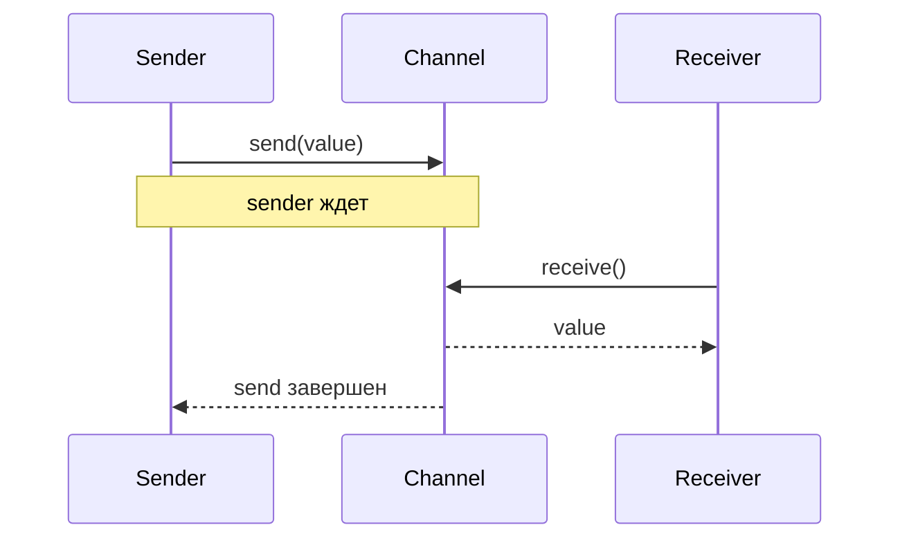
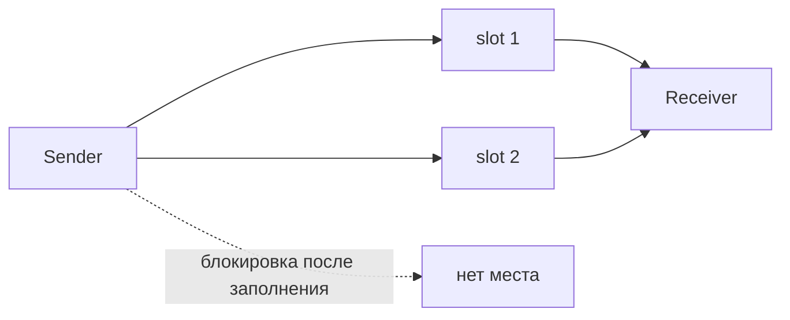
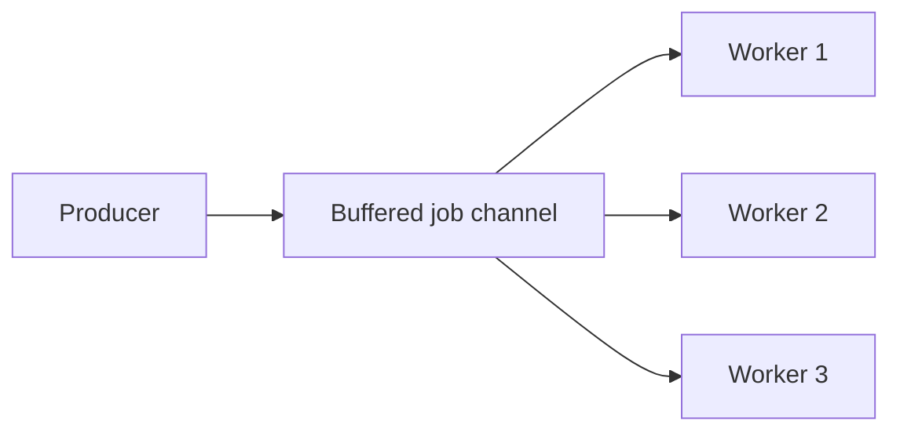
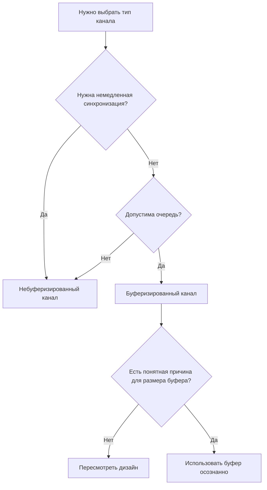

# Буферизированные и небуферизированные каналы в Go

Каналы в Go нужны для обмена данными между goroutine.
Главный вопрос, который нужно задать при выборе типа канала:

- нужна ли мне немедленная синхронизация между отправителем и получателем;
- или между ними допустима небольшая очередь.

Именно это и отличает небуферизированный канал от буферизированного.

## Небуферизированный канал

Небуферизированный канал создаётся без указания ёмкости:

```go
ch := make(chan int)
```

У такого канала нет внутренней очереди.
Отправка значения в канал блокируется, пока другая goroutine не начнёт это значение получать.

Проще говоря:

- отправитель не может просто "положить" значение и пойти дальше;
- получатель не может получить значение, если никто его не отправил;
- обмен происходит в момент встречи двух сторон.

### Как это выглядит



### Пример

```go
package main

import "fmt"

func main() {
    ch := make(chan string)

    go func() {
        ch <- "ping"
        fmt.Println("value sent")
    }()

    message := <-ch
    fmt.Println(message)
}
```

Здесь строка `ch <- "ping"` будет ждать, пока другая goroutine не выполнит чтение из канала.

## Буферизированный канал

Буферизированный канал создаётся с ёмкостью:

```go
ch := make(chan int, 3)
```

У такого канала есть внутренняя очередь ограниченного размера.
Отправитель может записывать значения в канал, пока в буфере есть свободное место.

Это значит:

- отправитель и получатель могут работать не строго одновременно;
- отправка блокируется только тогда, когда буфер полностью заполнен;
- чтение блокируется, когда буфер пуст.

### Как это выглядит



### Пример

```go
package main

import "fmt"

func main() {
    ch := make(chan int, 2)

    ch <- 10
    ch <- 20

    fmt.Println(<-ch)
    fmt.Println(<-ch)
}
```

Здесь две записи проходят сразу, потому что буфер вмещает два значения.

## Принципиальная разница

Если коротко:

- небуферизированный канал нужен для синхронной передачи данных;
- буферизированный канал нужен для асинхронной передачи с ограниченной очередью.

Небуферизированный канал не просто передаёт значение, он ещё и синхронизирует две goroutine.
Буферизированный канал ослабляет эту синхронизацию и позволяет временно разнести по времени отправку и получение.

## Когда лучше использовать небуферизированный канал

Небуферизированный канал подходит, когда важен сам факт синхронизации.

### 1. Когда нужно "рукопожатие" между goroutine

Если отправитель не должен идти дальше, пока получатель не готов принять значение, нужен небуферизированный канал.

Пример:

- одна goroutine сообщает другой, что работа завершена;
- запуск следующего шага допустим только после получения сигнала.

### 2. Когда нужно строгое управление порядком

Если каждая отправка должна соответствовать конкретному чтению прямо сейчас, небуферизированный канал делает это поведение более очевидным.

### 3. Когда очередь между сторонами не нужна

Если накопление задач или сообщений нежелательно, лучше не создавать скрытый буфер.

### 4. Когда важна простая модель рассуждения

Для многих сценариев новичкам и не только проще мыслить так:

- вот отправитель;
- вот получатель;
- они встречаются в точке обмена.

Это часто уменьшает количество неочевидных состояний.

## Когда лучше использовать буферизированный канал

Буферизированный канал подходит, когда допустима временная очередь между отправителем и получателем.

### 1. Когда отправитель может кратковременно работать быстрее получателя

Если скорость производства данных местами выше скорости обработки, буфер сглаживает такие всплески.

Пример:

- воркер читает задания медленнее, чем они появляются;
- но кратковременное накопление допустимо.

### 2. Когда не хочется блокировать отправителя на каждой операции

Если постоянная синхронизация слишком дорогая или просто не нужна по смыслу, буфер позволяет уменьшить число блокировок.

### 3. Когда есть пул воркеров

Частый сценарий: одна goroutine складывает задания в канал, несколько воркеров их читают.
Буфер может помочь не останавливать отправителя при каждом отдельном задании, если отставание обработки кратковременное.



### 4. Когда нужно отделить этапы конвейера

В pipeline-архитектуре один этап может генерировать данные чуть быстрее, чем следующий этап успевает их обрабатывать.
Буфер создаёт небольшую развязку между стадиями.

### 5. Когда буфер в worker pool не решает главную проблему

Есть важный сценарий, в котором размер буфера сам по себе почти ничего не меняет.

Представь такую модель:

- `worker` — это кассир в супермаркете;
- `job channel` — это очередь из людей к кассе.

Если кассир обслуживает одного человека за 2 минуты, то его пропускная способность ограничена.
Неважно, стоит ли перед ним очередь из 3 человек, 30 человек или 300 человек: быстрее обслуживать он от этого не начнёт.

То же самое и с worker pool:

- если воркеры обрабатывают задачи медленнее, чем задачи поступают;
- то увеличение буфера не решает проблему недостаточной пропускной способности.

Большой буфер в такой ситуации лишь даёт очереди вырасти внутри памяти программы.
Маленький буфер раньше начинает блокировать producer.
Но ни маленький, ни большой буфер не ускоряют сам `worker`.


Это важная мысль:

- буфер влияет на поведение очереди;
- буфер влияет на момент, когда начнётся backpressure;
- но буфер не увеличивает throughput обработчика.

Поэтому, если worker pool стабильно не успевает, нужно менять не размер канала как таковой, а саму систему:

- ускорять обработку одной задачи;
- увеличивать число воркеров;
- уменьшать входящий поток задач;
- выносить очередь во внешнюю систему, если in-memory буфер уже не подходит.

Буфер полезен, когда проблема во временном всплеске нагрузки.
Но если кассир в принципе слишком медленный для постоянного потока людей, длина очереди не лечит причину.

## Плюсы и минусы небуферизированных каналов

### Плюсы

- Простая и строгая синхронизация.
- Поведение легче предсказать, когда нужен обмен "один к одному".
- Ошибки координации проявляются раньше: если никто не читает, отправка сразу блокируется.
- Меньше риска незаметно накопить данные в памяти.

### Минусы

- Отправитель и получатель сильнее зависят друг от друга по времени.
- Производительность может страдать, если постоянная синхронизация не нужна.
- В некоторых конвейерах код становится более хрупким из-за лишней блокировки на каждом шаге.

## Плюсы и минусы буферизированных каналов

### Плюсы

- Позволяют сглаживать разницу в скорости между goroutine.
- Снижают количество немедленных блокировок.
- Хорошо подходят для очередей задач и промежуточных стадий pipeline.
- Дают больше гибкости при пиковых нагрузках.

### Минусы

- Нужно подбирать размер буфера, а это не всегда очевидно.
- Большой буфер может скрывать архитектурную проблему: данные копятся, а обработка не успевает.
- Становится сложнее понимать текущее состояние системы, потому что значения могут ждать в очереди.
- При аварийном завершении процесса содержимое буфера теряется, потому что канал живёт только в памяти.

## Как выбирать на практике

Полезно задать себе несколько вопросов.



### Нужно ли, чтобы отправитель ждал получателя прямо сейчас?

Если да, чаще всего нужен небуферизированный канал.

### Допустимо ли накопление значений в очереди?

Если да, можно использовать буферизированный канал.

### Что важнее: синхронизация или пропускная способность?

- если важнее точная координация, чаще подходит небуферизированный канал;
- если важнее сглаживание нагрузки, чаще подходит буферизированный канал.

### Есть ли понятная причина для конкретного размера буфера?

Если размер выбирается случайно, это плохой сигнал.
Ёмкость буфера должна отражать реальное ограничение или ожидаемую нагрузку.

Например:

- число воркеров;
- ожидаемый краткий всплеск задач;
- ограничение внешнего ресурса.

## Частые ошибки

### 1. Использовать буфер "на всякий случай"

Иногда буфер добавляют просто потому, что программа где-то блокируется.
Обычно это не решение причины, а маскировка проблемы координации.

### 2. Считать буферизированный канал надёжной очередью

Канал не сохраняет данные на диск и не переживает завершение процесса.
Если нужна гарантированная доставка, одного канала недостаточно.

### 3. Выбирать слишком большой буфер без измерений

Большой буфер может сделать поведение менее прозрачным и увеличить расход памяти.

Важно: рост буфера часто только откладывает момент блокировки, но не устраняет причину перегрузки.

### 4. Пытаться решить все задачи одним типом канала

В одном приложении часто нормально использовать оба типа:

- где-то для строгого сигнала;
- где-то для очереди задач.

## Короткие сценарии выбора

Используй небуферизированный канал, если:

- нужен точный сигнал между двумя goroutine;
- нельзя продолжать работу без готовности получателя;
- очередь сообщений между сторонами не нужна;
- важнее простая и строгая координация.

Используй буферизированный канал, если:

- допустимо временное накопление задач;
- отправитель и получатель работают с разной скоростью;
- нужен простой in-memory буфер между этапами обработки;
- важно уменьшить число блокировок на каждой отправке.

## Коротко

Небуферизированный канал лучше там, где важна синхронизация и мгновенная встреча отправителя с получателем.
Буферизированный канал лучше там, где нужна ограниченная очередь и стороны могут работать не строго одновременно.

Если сомневаешься, начинай с вопроса не про производительность, а про семантику:
нужно ли тебе именно синхронное взаимодействие или между goroutine допустима очередь.

## Итоговая таблица

| Сценарий | Что выбрать | Почему |
| --- | --- | --- |
| Нужно точное "рукопожатие" между двумя goroutine | Небуферизированный канал | Отправитель и получатель синхронизируются в момент обмена |
| Нельзя продолжать выполнение, пока другая сторона не приняла значение | Небуферизированный канал | Канал естественно заставляет ждать готовности получателя |
| Очередь между сторонами не нужна | Небуферизированный канал | Нет смысла вводить промежуточное накопление значений |
| Нужен строгий и предсказуемый порядок обмена | Небуферизированный канал | Поведение ближе к синхронной передаче "один к одному" |
| Отправитель кратковременно быстрее получателя | Буферизированный канал | Буфер сглаживает временный всплеск и уменьшает лишние блокировки |
| Есть очередь задач для worker pool | Буферизированный канал | Буфер удобен как in-memory очередь между producer и worker |
| Есть несколько стадий pipeline с разной скоростью | Буферизированный канал | Буфер создаёт развязку между соседними этапами |
| Нужно уменьшить число блокировок на каждой отправке | Буферизированный канал | Пока в буфере есть место, отправитель может идти дальше |
| Worker стабильно не успевает обрабатывать поток задач | Не размер буфера, а переработка дизайна | Буфер не увеличивает throughput и только откладывает момент блокировки |
| Нужна гарантированная доставка при падении процесса | Не полагаться только на канал | Канал живёт в памяти и не является надёжной персистентной очередью |
