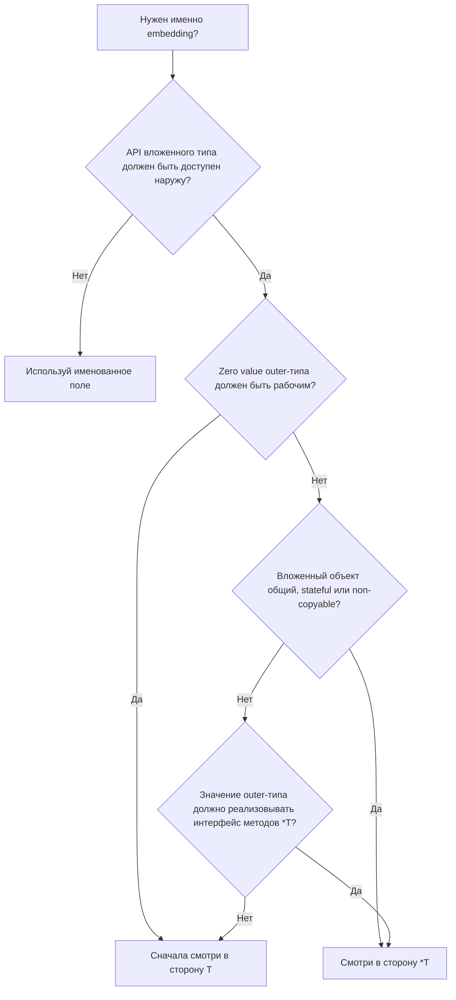

# Встраивание структур в Go: когда embed `T`, а когда `*T`

В Go embedding - это анонимное поле, которое продвигает поля и методы вложенного типа наружу.
Главный вопрос при выборе между `T` и `*T` такой:

- внешний объект действительно владеет этим состоянием;
- или он только ссылается на отдельный, общий или опциональный объект.

Именно это различие важнее, чем синтаксис вызова методов.

## Сначала важное: embedding не равно наследование

Если ты пишешь так:

```go
type Service struct {
    Logger
}
```

это не делает `Service` подтипом `Logger`.
Embedding в Go не создаёт классическую иерархию наследования.
Он лишь:

- добавляет анонимное поле;
- позволяет обращаться к полям и методам вложенного типа без явного имени поля;
- расширяет method set внешнего типа по правилам promotion.

Из этого следует практическое правило:

- если API вложенного типа не должно "протекать" наружу, чаще нужен обычный именованный field, а не embedding.

## Что реально меняется между `T` и `*T`

Разница не в том, можно ли вызвать метод через точку.
Разница в семантике хранения, копирования, zero value и интерфейсов.

Если embed'ить `T`:

- внешний struct физически содержит `T` внутри себя;
- копирование внешнего struct копирует и `T`;
- zero value внешнего struct сразу содержит zero value вложенного `T`;
- у вложенного поля нет состояния `nil`.

Если embed'ить `*T`:

- внешний struct хранит только указатель;
- копирование внешнего struct копирует ссылку, а не состояние;
- zero value внешнего struct содержит `nil` в embedded-поле;
- появляется отдельный жизненный цикл и требование инициализации.

### Как это выглядит при копировании

```go
package main

import "fmt"

type Counter struct {
    N int
}

type ByValue struct {
    Counter
}

type ByPointer struct {
    *Counter
}

func main() {
    a := ByValue{Counter: Counter{N: 1}}
    b := a
    b.N = 2

    fmt.Println(a.N, b.N) // 1 2

    x := ByPointer{Counter: &Counter{N: 1}}
    y := x
    y.N = 2

    fmt.Println(x.N, y.N) // 2 2
}
```

В первом случае внешний объект владеет собственной копией состояния.
Во втором случае оба объекта разделяют один и тот же `Counter`.

## Когда embed значением обычно лучше

Embedding значением хорошо работает, когда вложенный тип действительно является частью состояния внешнего объекта, а не отдельной сущностью с собственным жизненным циклом.

Обычно `T` лучше, если:

- zero value внешнего типа должен быть валидным и полезным;
- вложенный тип логически принадлежит внешнему объекту;
- копии внешнего объекта должны быть независимыми;
- состояние `nil` не нужно и только усложнит инварианты;
- вложенный тип маленький или хотя бы безопасный для копирования.

### Пример: данные, которыми объект владеет сам

```go
type Audit struct {
    CreatedBy string
    UpdatedBy string
}

func (a Audit) Empty() bool {
    return a.CreatedBy == "" && a.UpdatedBy == ""
}

type Order struct {
    Audit
    Number string
}
```

Здесь `Audit` - это часть состояния `Order`, а не внешняя зависимость.
У такого решения есть понятные свойства:

- `var o Order` уже содержит валидный zero value для `Audit`;
- копия `Order` получает собственную копию `Audit`;
- у `Order` нет дополнительного риска словить `nil` внутри embedded-поля.

Такой embedding обычно хорошо подходит для:

- метаданных;
- маленьких value-objects;
- структур с хорошим zero value;
- случаев, где владение состоянием должно быть очевидным из самой модели.

## Когда embed указателем обычно лучше

Embedding указателем уместен, когда вложенный тип живёт по своим правилам: требует инициализации, разделяется между несколькими объектами, дорого копируется или вообще не должен копироваться как значение.

Обычно `*T` лучше, если:

- несколько внешних объектов должны разделять одно состояние;
- zero value внешнего типа не обязан быть рабочим без конструктора;
- вложенный тип тяжёлый, stateful или небезопасен для копирования;
- жизненный цикл вложенного объекта отличается от жизненного цикла внешнего;
- outer value должен получить в method set методы, объявленные на `*T`.

### Пример: общий stateful-компонент

```go
type Engine struct {
    started bool
}

func (e *Engine) Start() {
    e.started = true
}

type Car struct {
    *Engine
}
```

Такой `Car` не владеет состоянием двигателя по значению.
Он только ссылается на него.
Это полезно, когда:

- один и тот же компонент передаётся дальше как зависимость;
- инициализация обязательна и всё равно делается через конструктор;
- копирование `Car` не должно дублировать внутреннее состояние `Engine`.

Но цена за это очевидна:

- `var c Car` содержит `nil` в `Engine`;
- вызов promoted-метода до инициализации приведёт к ошибке времени выполнения;
- корректность типа теперь зависит не только от формы struct, но и от порядка инициализации.

## Самая частая ловушка: вызов метода и method set - не одно и то же

Это место, где многие ошибаются.

Если метод объявлен на `*T`, это ещё не значит, что значение outer struct будет реализовывать интерфейс после embedding `T`.

```go
package main

type Runner interface {
    Start()
}

type Engine struct {
    started bool
}

func (e *Engine) Start() {
    e.started = true
}

type CarValue struct {
    Engine
}

type CarPointer struct {
    *Engine
}

var _ Runner = (*CarValue)(nil)
// var _ Runner = CarValue{} // не компилируется

var _ Runner = CarPointer{}
```

Что здесь важно:

- если embed'ить `Engine` значением, то значение `CarValue` не получает в свой method set методы с receiver `*Engine`;
- при этом `*CarValue` такие методы получает;
- если embed'ить `*Engine`, то даже значение `CarPointer` получает promoted-методы с receiver `*Engine`.

Отсюда важный практический вывод:

- то, что `value.Start()` компилируется в конкретной точке кода, ещё не означает, что это значение удовлетворяет интерфейсу.

Это особенно важно в коде с `io.Closer`, `http.Handler`, внутренними интерфейсами адаптеров и compile-time assertions.

## Zero value против обязательной инициализации

Выбор между `T` и `*T` часто на самом деле сводится к вопросу:

- хочешь ли ты, чтобы zero value внешнего типа был полезным;
- или тебе нормальна обязательная инициализация через конструктор.

Embedding значением даёт более сильное свойство по умолчанию:

- объект уже собран структурно;
- внутри нет `nil` на месте embedded-поля;
- меньше шансов поймать runtime-падение из-за забытых зависимостей.

Embedding указателем делает нулевое значение слабее:

- outer struct может быть синтаксически создан, но логически невалиден;
- ошибки смещаются из compile-time и zero value semantics в фазу инициализации;
- без конструктора или явной проверки `nil` код становится хрупче.

Если тип должен быть удобен как обычная value-структура, `T` обычно лучше.
Если тип без конструктора всё равно не имеет смысла, `*T` может быть нормальным выбором.

## Не выбирай `*T` только из страха копирования

Это частая переоценка.

Иногда разработчик видит большой вложенный struct и автоматически переходит на `*T`, чтобы "не копировать лишнее".
Но правильный вопрос другой:

- внешний объект вообще часто копируется;
- копирование действительно находится на горячем пути;
- или это преждевременная оптимизация ценой более слабых инвариантов.

Если outer struct почти всегда живёт за указателем и не копируется по значению, выгода от `*T` может быть минимальной.
А цена в виде `nil`, обязательной инициализации и более сложной модели владения останется.

## Когда embedding вообще не нужен

Во многих случаях выбор не между `T` и `*T`, а между embedding и обычным полем.

Не embed'и тип, если:

- ты не хочешь поднимать его API наружу;
- вложенный тип - это просто dependency, а не часть публичной модели;
- продвижение всех его методов создаёт слишком широкий или хрупкий интерфейс;
- ты оборачиваешь внешний пакет и не хочешь жёстко привязывать свой API к его API.

Пример, где именованное поле часто лучше embedding:

```go
type Service struct {
    logger *slog.Logger
}
```

А не так:

```go
type Service struct {
    *slog.Logger
}
```

Во втором случае `Service` внезапно начинает выглядеть как логгер с дополнительными методами, хотя по смыслу это не так.

## Как выбирать на практике

Полезно прогонять решение через несколько вопросов.



### Вопрос 1. Внешний объект владеет этим состоянием или только ссылается на него?

- если владеет, чаще выбирай `T`;
- если только ссылается или разделяет, чаще выбирай `*T`.

### Вопрос 2. Нужен ли хороший zero value?

- если да, `T` обычно предпочтительнее;
- если без конструктора тип всё равно невалиден, `*T` допустим.

### Вопрос 3. Нужно ли безопасное копирование outer struct?

- если копии должны быть независимыми, выбирай `T`;
- если копии должны разделять один компонент, выбирай `*T`.

### Вопрос 4. Нужен ли outer value как реализация интерфейса методов, объявленных на `*T`?

- если да, embedding `*T` даёт другую семантику method set, чем embedding `T`.

## Частые ошибки

### 1. Embed'ить `*T` только потому, что методы у типа объявлены на указателе

Это может помочь с method set, но одновременно вводит `nil` и обязательную инициализацию.
Если тебе не нужно делить состояние и не нужен именно такой interface surface, это часто лишнее.

### 2. Embed'ить `T` для stateful или non-copyable-компонента

Если вложенный тип содержит соединения, пулы, mutex'ы, внутренние кэши или другое чувствительное состояние, value-embedding может сделать случайное копирование слишком дешёвым и слишком опасным.

### 3. Использовать embedding вместо явной композиции

Embedding - это не просто способ "сэкономить на имени поля".
Он меняет публичный API типа.

### 4. Забывать, что `CarPointer{}` может удовлетворять интерфейсу и при этом быть неинициализированным

Компилятор проверяет method set, а не то, что внутри уже лежит ненулевой указатель.

## Короткие правила

Используй `T`, если:

- outer object владеет этим состоянием;
- zero value должен быть полезным;
- копии должны быть независимыми;
- `nil` внутри модели только мешает;
- вложенный тип безопасно копировать.

Используй `*T`, если:

- состояние должно быть общим;
- вложенный объект требует явной инициализации;
- тип тяжёлый или нежелателен для копирования;
- outer value должен получить pointer-receiver methods вложенного типа в свой method set;
- у вложенного объекта свой жизненный цикл.

Используй именованное поле, если:

- API вложенного типа не должен становиться API внешнего типа;
- тебе нужна обычная композиция без promotion;
- embedding делает модель менее очевидной.

## Коротко

`T` в embedding - это выбор в пользу владения, хорошего zero value и независимых копий.
`*T` - это выбор в пользу разделяемого состояния, отдельного жизненного цикла и другой семантики method set.

Если сомневаешься, не спрашивай сначала про синтаксис вызова метода.
Спроси про модель владения:

- кто владеет состоянием;
- допустим ли `nil`;
- должен ли zero value быть рабочим;
- должны ли копии разделять один и тот же вложенный объект.

После этого выбор между `T` и `*T` обычно становится механическим.

## Итоговая таблица

| Сценарий | Что выбрать | Почему |
| --- | --- | --- |
| Внешний тип действительно владеет вложенным состоянием | `T` | Состояние хранится внутри объекта, а не за отдельной ссылкой |
| Zero value внешнего типа должен быть пригоден к использованию | `T` | Внутри сразу лежит zero value вложенного типа, без `nil` |
| Копии внешнего объекта должны быть независимыми | `T` | Value-embedding копирует состояние, а не делит его |
| Вложенный объект общий для нескольких владельцев | `*T` | Копируется ссылка на один и тот же компонент |
| Вложенный тип требует обязательной инициализации и живёт по своему lifecycle | `*T` | Указатель лучше отражает отдельный жизненный цикл |
| Значение outer-типа должно удовлетворять интерфейсу методов, объявленных на `*T` | `*T` | У embedding `*T` другой promoted method set |
| `nil` внутри модели недопустим и только усложняет инварианты | `T` | Проще поддерживать корректное состояние без конструктора |
| Вложенный тип - просто dependency, API которой не должен подниматься наружу | Именованное поле | Здесь обычно нужна композиция без embedding |
| Выбор `*T` делается только из страха "лишней копии" без профилирования | Обычно не `*T` по этой причине | Это часто преждевременная оптимизация ценой более слабой модели |
