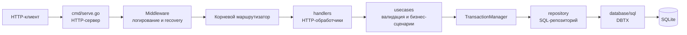
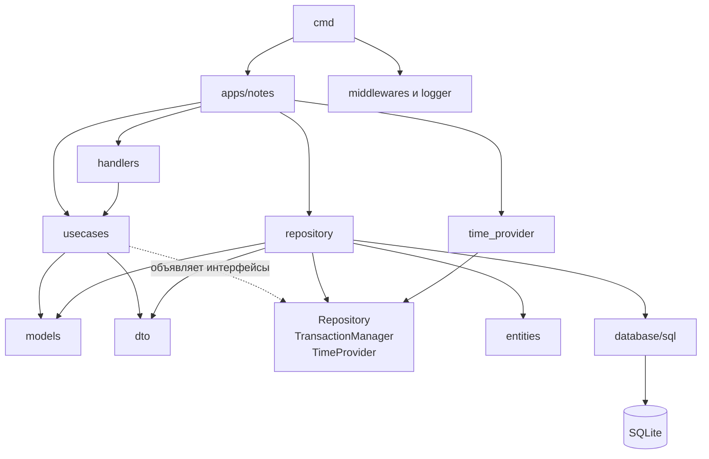
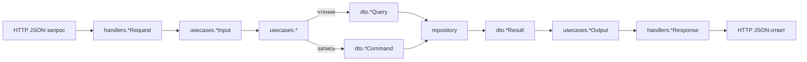

# notesv1

`notesv1` - небольшой HTTP-сервис для управления заметками. В нём используются
стандартный HTTP-маршрутизатор Go, SQLite, SQL-миграции и структура пакетов,
которая разделяет HTTP, бизнес-правила и доступ к базе данных.

## Требования

- Go `1.26.4` или совместимая версия, указанная в `go.mod`
- [Task](https://taskfile.dev/)
- CLI-утилита `migrate` с поддержкой драйвера SQLite

Зависимости Go, включая драйвер SQLite и Mockery, описаны в `go.mod`; для их
установки выполните `go mod download`.

```bash
cd notesv1
go mod download
```

## Настройка и запуск

Конфигурация считывается через `envconfig` с префиксом `NOTES_V1`:

| Переменная | Обязательна | Значение по умолчанию | Назначение |
| --- | --- | --- | --- |
| `NOTES_V1_DB_DSN` | да | - | Строка подключения или путь к базе SQLite |
| `NOTES_V1_HTTP_PORT` | нет | `8080` | Порт HTTP-сервера |

В локальном `.env` задана переменная `NOTES_V1_DB_DSN="bin/notes.db"`. Task
загружает этот файл, поэтому обычный локальный запуск выглядит так:

```bash
task serve
```

Перед запуском `serve` применяет все ожидающие миграции, затем выполняет
`go run main.go serve`. Сервис доступен по адресу `http://localhost:8080`.
Он обрабатывает сигналы `SIGINT` и `SIGTERM` и останавливает HTTP-сервер с
тайм-аутом пять секунд.

Перед началом обработки запросов сервер проверяет соединение с базой методом
`PingContext`. Для прямого запуска сначала экспортируйте необходимую
конфигурацию:

```bash
export NOTES_V1_DB_DSN='bin/notes.db'
go run main.go serve
```

## HTTP API

Все маршруты заметок имеют префикс `/notes`. В каталоге `scripts` находится
HTTP-клиент `client.http` для расширения VS Code REST Client: он содержит
готовые запросы health-check и CRUD-операций с заметками.

| Метод | Путь | Описание | Успешный ответ |
| --- | --- | --- | --- |
| `GET` | `/alive` | Проверка работоспособности | `200 OK` |
| `GET` | `/notes/` | Получить все заметки | `200 OK` с `{ "items": [...] }` |
| `POST` | `/notes/` | Создать заметку | `201 Created` с `{ "id": 1 }` |
| `GET` | `/notes/{id}` | Получить заметку | `200 OK` с заметкой |
| `PUT` | `/notes/{id}` | Обновить заметку | `200 OK` |
| `DELETE` | `/notes/{id}` | Удалить заметку | `204 No Content` |

Пример запроса:

```bash
curl -X POST http://localhost:8080/notes/ \
 -H 'Content-Type: application/json' \
 -d '{"title":"My note","body":"Text"}'
```

При создании и обновлении поле `title` должно содержать от 1 до 256 рун. Поле
`body` можно опустить или передать как `null`, но заданное значение не может
быть пустым. Некорректное тело JSON или некорректный числовой `{id}` возвращают
`400`; получение или обновление отсутствующей заметки возвращает `404`.

JSON-представление заметки:

```json
{
 "id": 1,
 "title": "My note",
 "body": "Text",
 "created_at": "2026-08-16T12:00:00Z",
 "updated_at": "2026-08-16T12:00:00Z"
}
```

Если `body` равно `null`, это поле не включается в ответ. Временные метки
хранятся и выдаются в UTC с точностью до микросекунд.

## Архитектура

Композиционный корень находится в `cmd/serve.go`: он загружает конфигурацию,
открывает SQLite, создаёт HTTP-маршрутизатор и добавляет middleware логирования
и восстановления после panic. В `internal/apps/notes/notes.go` собирается
пакет заметок: конкретные менеджер транзакций и источник времени передаются в
use cases, а use cases - в обработчики.

### Поток обработки запроса



### Направление зависимостей

Стрелка показывает зависимость пакета или адаптера от другого компонента.
Реализации репозитория и часов зависят от контрактов use cases, а не наоборот.



Зависимости направлены внутрь: внешние адаптеры знают о ядре приложения, но
ядро не импортирует HTTP, `database/sql`, SQLite или конкретную реализацию
часов. Это позволяет тестировать use cases с помощью сгенерированных моков.

**Правило слоёв:** вся бизнес-логика приложения описывается только в слое
`usecases`. К ней относятся валидация, бизнес-инварианты, последовательность
операций, выбор транзакционных границ, работа со временем и преобразование
ошибок в ошибки предметной области. Обработчики адаптируют HTTP-запросы и
ответы, а репозитории выполняют SQL и маппинг данных, не принимая бизнес-решений.

| Пакет | Ответственность |
| --- | --- |
| `cmd` | CLI Cobra, загрузка конфигурации, соединение с БД, корневой маршрутизатор и корректное завершение работы |
| `internal/middlewares`, `internal/logger` | Структурированное логирование запросов, recovery и логгер в контексте запроса |
| `internal/apps/notes/handlers` | Декодирование и кодирование HTTP, параметры маршрута и сопоставление ошибок со статусами HTTP |
| `internal/apps/notes/usecases` | Валидация, бизнес-сценарии, семантика ошибок, интерфейсы зависимостей и контракты `Input`/`Output` |
| `internal/apps/notes/models` | Модель приложения, используемая use cases и обработчиками |
| `internal/apps/notes/dto` | Контракты команд, запросов и результатов репозитория |
| `internal/apps/notes/repository` | SQL для SQLite, маппинг строк и реализация транзакций |
| `internal/apps/notes/time_provider` | Рабочая реализация часов UTC |
| `internal/entities` | Представление строки БД и константы таблиц и столбцов |
| `pkg/config` | Универсальный загрузчик конфигурации из окружения |

### Маппинги данных

Каждый слой использует представление данных, подходящее его границе:



Обработчики не выполняют SQL, а репозитории не декодируют HTTP. Репозиторий
преобразует допускающий `NULL` столбец `notes.body` из `sql.NullString` в
`*string`, сохраняя различие между `NULL` и непустым значением.

Use cases всегда принимают структуру `*Input` и возвращают структуру `*Output`.
Они отвечают за валидацию и получение времени и зависят от объявленных в своём
пакете интерфейсов `Repository`, `TransactionManager` и `TimeProvider`.

Методы репозитория всегда принимают один из двух типов DTO: `*Query` для чтения
или `*Command` для записи. Независимо от операции они возвращают `*Result`.
Таким образом HTTP-модель и модель приложения не передаются в SQL-слой
напрямую.

`UpdateNote` использует `WithTransaction`: заметка читается и обновляется в
одной транзакции, которая фиксируется, только если обе операции успешны.
Операции чтения, создания и удаления получают нетранзакционный репозиторий из
менеджера транзакций.

## База данных и миграции

Приложение использует pure-Go драйвер `modernc.org/sqlite`. По умолчанию данные
локальной разработки хранятся в `bin/notes.db`, что задано в `.env`.

Файлы миграций находятся в `migrations/`. Начальная миграция создаёт:

```sql
CREATE TABLE notes (
  id INTEGER PRIMARY KEY AUTOINCREMENT,
  title TEXT NOT NULL,
  body TEXT,
  created_at DATETIME NOT NULL,
  updated_at DATETIME NOT NULL
);
```

В `Taskfile.yaml` для миграций используется отдельный DSN:
`sqlite://bin/notes.db?x-no-tx-wrap=true`. Это формат URL, ожидаемый SQLite
драйвером `migrate`; он указывает на тот же локальный файл базы, что и DSN
приложения.

| Команда | Действие |
| --- | --- |
| `task migrate-up-all` | Применить все ожидающие миграции |
| `task migrate-up n=1` | Применить `n` миграций; по умолчанию `1` |
| `task migrate-down n=1` | Откатить `n` миграций; по умолчанию `1` |
| `task migrate-new name=add_tags` | Создать парные файлы SQL-миграции up/down |
| `task reset-db` | Удалить `bin/notes.db` и повторно применить все миграции |

Не изменяйте миграцию, уже применённую в общем окружении. Вместо этого добавьте
новую пронумерованную миграцию и предусмотрите для неё соответствующий откат в
файле `.down.sql`.

## Тесты и моки

Тесты use cases находятся рядом с тестируемым кодом. Они используют моки
интерфейсов, объявленных слоем use cases, поэтому бизнес-логику можно проверять
без HTTP и SQLite:

```bash
task tests
```

Команда выполняет `go test -race -v ./...`.

Mockery настроен в `.mockery.yaml` так, чтобы рекурсивно сканировать
`internal/apps/notes`, генерировать testify-моки для всех интерфейсов и
сохранять их в `tests/mocks/`, повторяя внутреннюю структуру пакетов:

```bash
task gen-mocks
```

Запускайте эту команду после добавления или изменения интерфейса, используемого
тестами. Сгенерированные моки являются тестовой инфраструктурой; обновляйте их
вместе с соответствующим контрактом интерфейса.

## Команды Task

```bash
task serve                    # применить миграции и запустить сервис
task tests                    # запустить все тесты с race detector
task gen-mocks                # заново сгенерировать моки Mockery
task migrate-up-all           # применить ожидающие миграции
task migrate-up n=1           # применить выбранное число миграций
task migrate-down n=1         # откатить выбранное число миграций
task migrate-new name=example # создать пару файлов миграции
task reset-db                 # пересоздать локальную базу данных
```
